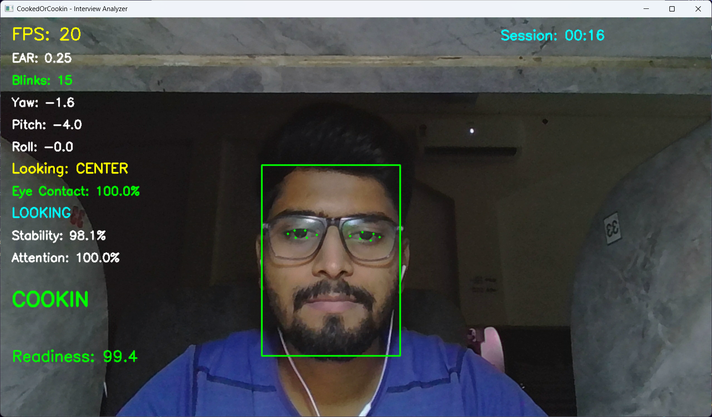
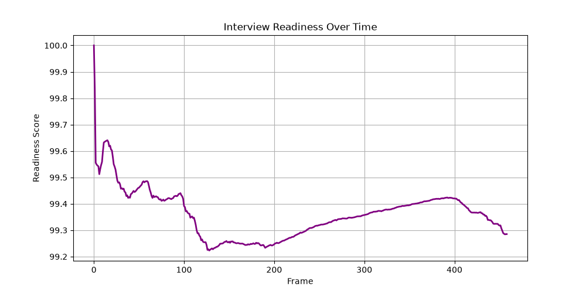
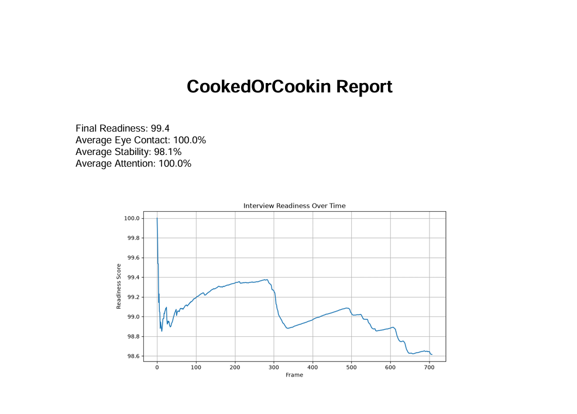

# 🔥 CookedOrCookin

<p align="center">
  <h1 align="center">CookedOrCookin</h1>
  <h3 align="center">
    Are You Ready For The Interview, Or Are You Cooked?
  </h3>
</p>

<p align="center">
  Real-Time Interview Readiness & Integrity Analyzer using Computer Vision
</p>

<p align="center">
  
  
  
  
</p>

---

## 📖 Overview

CookedOrCookin is a real-time interview readiness and integrity analysis platform built using Computer Vision, OpenCV, MediaPipe Face Mesh, and YuNet Face Detection.

The system evaluates candidate behavior during mock interviews and generates actionable insights through eye contact analysis, blink tracking, attention monitoring, head pose estimation, stability analysis, readiness scoring, integrity validation, and automated PDF reporting.

Unlike traditional interview preparation tools, CookedOrCookin not only measures interview readiness but also validates interview authenticity using face presence tracking, multiple-face detection, integrity scoring, and automatic session validation.

---

# 🎥 Demo

<h1 align="center">🎥 Demo</h1>

<p align="center">

  

</p>
> Replace `demo.mp4` with your actual screen recording GIF for maximum impact.

---

# 📸 Project Preview

## Real-Time Interview Analyzer

<p align="center">
  
</p>

The system analyzes interview behavior in real time and tracks:

* Eye Contact
* Blink Activity
* Head Pose
* Attention
* Stability
* Presence Score
* Integrity Score
* Readiness Score
* Face Count

---

## Readiness Trend Graph

<p align="center">
  
</p>

The application records readiness throughout the interview session and visualizes performance changes over time.

---

## Automated PDF Report

<p align="center">
  
</p>

After each session, a detailed PDF report is automatically generated containing readiness analytics, integrity metrics, session statistics, and performance summaries.

---

# ✨ Key Features

| Feature                    | Description                              |
| -------------------------- | ---------------------------------------- |
| 👁 Eye Contact Analysis    | Measures camera engagement and focus     |
| 👀 Blink Detection         | EAR-based blink tracking                 |
| 🧠 Head Pose Estimation    | Yaw, Pitch and Roll monitoring           |
| 🎯 Attention Analysis      | Candidate engagement tracking            |
| 📌 Stability Analysis      | Head movement consistency measurement    |
| 📊 Readiness Score         | Overall interview readiness scoring      |
| 🚨 Multiple Face Detection | Detects interview environment violations |
| 👤 Presence Tracking       | Candidate visibility monitoring          |
| 🔒 Integrity Score         | Interview authenticity scoring           |
| ✅ Session Validation       | Valid / Invalid session determination    |
| 📈 Readiness Visualization | Performance trend analysis               |
| 📄 Automated PDF Reports   | Detailed session reporting               |

---

# 🛡️ Interview Integrity System

CookedOrCookin includes a dedicated integrity validation layer that ensures interview authenticity.

### Multiple Face Detection

Detects when more than one person appears in the frame.

Features:

* Live Warning Overlay
* Multiple Face Event Tracking
* Integrity Penalty
* Session Validation Impact

### Face Presence Tracking

Measures whether the candidate remains visible throughout the interview.

Metrics:

* Visible Face Frames
* Total Frames
* Presence Score %

### Auto Session Protection

Automatically terminates the session when:

* No face is detected continuously for more than 10 seconds

### Integrity Score

Calculates interview authenticity using:

* Presence Score
* Multiple Face Events
* Session Violations

Range:

```text
0 - 100
```

### Session Status

Possible outcomes:

```text
VALID SESSION
INVALID SESSION
```

---

# 📊 Metrics Tracked

## Candidate Metrics

* Eye Contact %
* Blink Count
* Attention %
* Stability %
* Head Pose
* Readiness Score

## Integrity Metrics

* Presence Score
* Multiple Face Events
* Session Status
* Integrity Score
* Auto-Termination Status

---

# 🏗️ System Architecture

```text
Webcam
   ↓
OpenCV
   ↓
YuNet Face Detector
   ↓
Interview Integrity Layer
   ├── Face Count Validation
   ├── Multiple Face Detection
   ├── Presence Tracking
   └── Auto Session Protection
   ↓
MediaPipe Face Mesh
   ↓
Behavior Analytics Engine
   ├── Blink Detection
   ├── Eye Contact Analysis
   ├── Head Pose Estimation
   ├── Stability Analysis
   └── Attention Analysis
   ↓
Readiness Score Engine
   ↓
Integrity Score Engine
   ↓
Session Tracker
   ↓
Graph Generator
   ↓
PDF Report Generator
```

---

# 🖥️ Tech Stack

## Computer Vision

* OpenCV
* MediaPipe Face Mesh
* YuNet Face Detector

## Data Processing

* NumPy
* Pandas

## Visualization

* Matplotlib

## Reporting

* ReportLab

## Language

* Python

---

# 📂 Project Structure

```text
CookedOrCookin/

│
├── app.py
│
├── analytics/
│   ├── blink.py
│   ├── eye_contact.py
│   ├── head_pose.py
│   ├── stability.py
│   ├── attention.py
│   └── session_tracker.py
│
├── core/
│   ├── face_detector.py
│   └── landmark_detector.py
│
├── reports/
│   └── report_generator.py
│
├── assets/
│   └── face_detection_yunet_2023mar.onnx
│
├── screenshots/
│   ├── analyzer_dashboard.png
│   ├── readiness_graph.png
│   ├── generated_report.png
│   └── demo.gif
│
├── requirements.txt
│
└── README.md
```

---

# ⚡ Installation

## Clone Repository

```bash
git clone https://github.com/UtkarshUpadhyay31/CookedOrCookin.git

cd CookedOrCookin
```

## Create Virtual Environment

```bash
python -m venv venv
```

### Windows

```bash
venv\Scripts\activate
```

### Linux / Mac

```bash
source venv/bin/activate
```

---

## Install Dependencies

```bash
pip install -r requirements.txt
```

---

# ▶️ Run Application

```bash
python app.py
```

Press:

```text
ESC
```

to manually terminate the session.

The application will automatically terminate the session if no face is detected for more than 10 seconds.

---

# 📊 Sample Output

```text
Eye Contact      : 96.4%
Stability        : 97.8%
Attention        : 94.3%

Presence Score   : 98.7%
Integrity Score  : 100

Readiness        : 95.2

Session Status   : VALID

Verdict          : COOKIN
```

---

# 📈 Sample Analytics

```text
Session Duration      : 05:42

Average Eye Contact   : 95.4%
Average Stability     : 97.1%
Average Attention     : 93.8%

Presence Score        : 99.2%
Integrity Score       : 100

Multiple Face Events  : 0

Session Status        : VALID

Final Readiness       : 94.7
```

---

# 🎯 Use Cases

* Mock Interviews
* Placement Preparation
* Communication Practice
* Public Speaking Training
* Career Coaching
* Behavioral Analytics Research
* Candidate Performance Evaluation
* Interview Readiness Assessment

---

# 🧠 Technical Highlights

* Real-Time Computer Vision Pipeline
* CPU Optimized Processing
* YuNet Face Detection
* MediaPipe Face Mesh
* Modular Analytics Architecture
* Automated Reporting Engine
* Interview Integrity Validation Layer
* Presence Tracking System
* Multi-Metric Readiness Scoring
* Session Analytics Pipeline

---

# 🏆 Why This Project Stands Out

Unlike traditional interview preparation tools, CookedOrCookin evaluates both:

### 1. Interview Readiness

* Eye Contact
* Attention
* Stability
* Head Pose
* Blink Behavior

### 2. Interview Integrity

* Presence Tracking
* Multiple Face Detection
* Session Validation
* Integrity Scoring

This makes the platform suitable for:

* Placement Preparation
* Mock Interviews
* Career Coaching
* Communication Training
* Behavioral Analytics Research

---

# 🔮 Future Roadmap

* Streamlit Dashboard
* Historical Performance Tracking
* Multi-Session Analytics
* AI Feedback Assistant
* Interview Recording Support
* Recruiter Dashboard
* Cloud Deployment
* AI-Powered Interview Insights
* Interview Benchmark Comparison

---

# 👨‍💻 Author

## Utkarsh Upadhyay

B.Tech Information Technology
Rajkiya Engineering College, Azamgarh

### Achievements

🏆 SIH Finalist
🏆 AI Hackathon Winner

### Connect

* GitHub: https://github.com/UtkarshUpadhyay31
* LinkedIn: https://www.linkedin.com/in/utkarshupadhyay31/

---

## ⭐ If you found this project useful, consider giving it a star.

### Built with OpenCV, MediaPipe, YuNet and a lot of caffeine ☕
